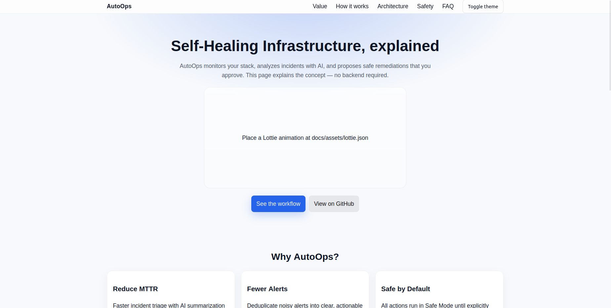
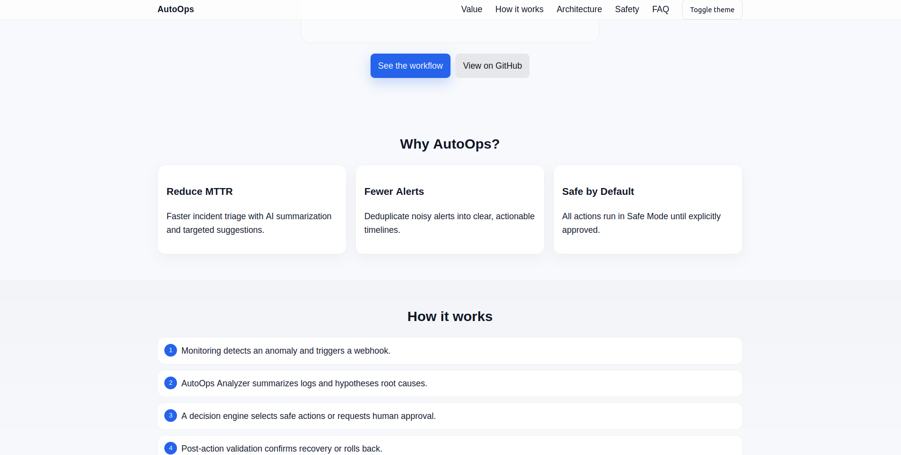
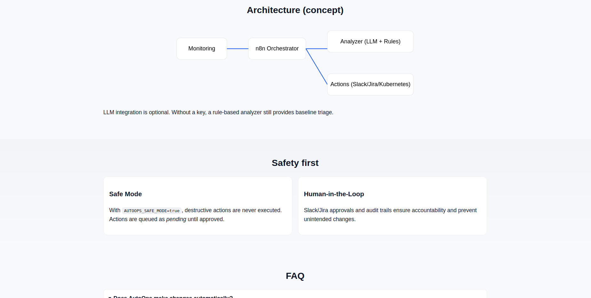
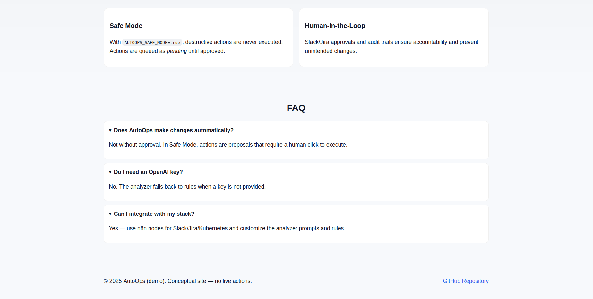

# AutoOps — Self‑Healing Infrastructure (concept site)

This repository hosts a polished, explanatory landing page for the idea of “AutoOps — Self‑Healing Infrastructure.”

The site explains how AutoOps would monitor your stack, analyze incidents with AI, and propose safe remediations that you approve. It is a concept/overview only — it does not run live remediation or call any backend services.

## Contents
- `docs/` : static explanatory site (index.html) with Lottie animation (no live backend)
- `backend/` : FastAPI demo app with analyzer module (OpenAI integration fallback)
- `n8n-workflows/` : exported n8n workflow skeleton (Webhook → Analyzer → Action)
- `docker-compose.yml` : run `backend` + `n8n` locally
- `.github/workflows/deploy-pages.yml` : CI to publish `docs/` to GitHub Pages

## View locally (for screenshots)
Open the static site in a simple local server and take screenshots:

```bash
cd docs
python3 -m http.server 8080
# then visit http://localhost:8080
```

## Live repository

This repo is hosted on GitHub: [`sayedomarr/autoops-website`](https://github.com/sayedomarr/autoops-website)

If you enable GitHub Pages (Actions → gh-pages workflow), the `docs/` site will be served automatically.

## Deploy to GitHub Pages

This repository includes `.github/workflows/deploy-pages.yml` which publishes the `docs/` directory. To deploy:

1. Push your changes to the `main` branch of `sayedomarr/autoops-website`.
2. In GitHub, open Settings → Pages and set Source to “GitHub Actions.”
3. Check the Actions tab; the “Deploy Docs to GitHub Pages” workflow will run and publish.
4. Your site will be available at `https://sayedomarr.github.io/autoops-website/` once the workflow completes.

## Project structure

```text
autoops-website/
├─ .github/workflows/
│  └─ deploy-pages.yml              # Publish docs/ to GitHub Pages
├─ backend/
│  ├─ app/
│  │  ├─ __init__.py
│  │  ├─ analyzer.py                # OpenAI + rule-based analyzer
│  │  └─ main.py                    # FastAPI endpoints
│  ├─ tests/
│  │  └─ test_analyzer.py
│  ├─ Dockerfile
│  └─ requirements.txt
├─ docs/
│  ├─ assets/
│  │  ├─ README.md                  # Lottie instructions
│  │  └─ screenshots/               # Place your screenshots here
│  ├─ css/
│  │  └─ styles.css                 # Modern styles + dark mode
│  ├─ .nojekyll                     # Ensure assets served as-is
│  └─ index.html                    # Explanatory landing page (no backend)
├─ n8n-workflows/
│  ├─ README.md
│  └─ autoops-workflow.json         # n8n skeleton (Webhook → Analyze → Act)
├─ docker-compose.yml               # (Optional) backend + n8n for local demo
├─ env.example                      # Sample environment (optional backend)
├─ .env                             # Local env (do not commit secrets)
├─ LICENSE                          # MIT
└─ README.md
```

## Screenshots

The following screenshots are included under `docs/assets/screenshots/` and shown here in order:






## Safety principles (concept)

- Safe Mode by default (`AUTOOPS_SAFE_MODE=true`): destructive actions are never executed automatically.
- Human‑in‑the‑loop approvals (Slack/Jira) before any infra changes.
- LLM integration is optional; rule‑based fallback stays available.

## Optional: run the demo backend (not required)
Only if you want to experiment locally with the demo API:

```bash
cp env.example .env
docker-compose up --build
# Health check: http://localhost:8000/api/health
```

## License

MIT


